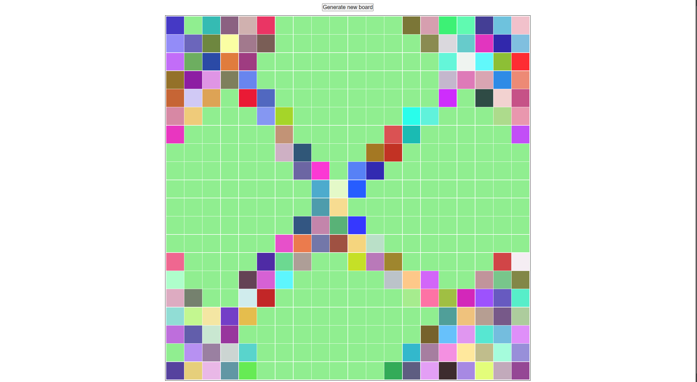

# Etch-A-Sketch
*Etch A Stetch* game project from [The Odin Project](https://www.theodinproject.com/about) course

## Preview link
https://yurii-ruban.github.io/top-etch-a-sketch

## Skills
 - Javascript basics
    * Working with primitive data types (strings, numbers)
    * Working with Math *random()*

- DOM manipulation
    * Creating and removing elements
    * Applying and removing styles using Javascript

## Purpose
Etch A Sketch project purpose is to demonstrate simple DOM-Manipulation and dimensions calculation while creating Sketch board.

## Screenshot

